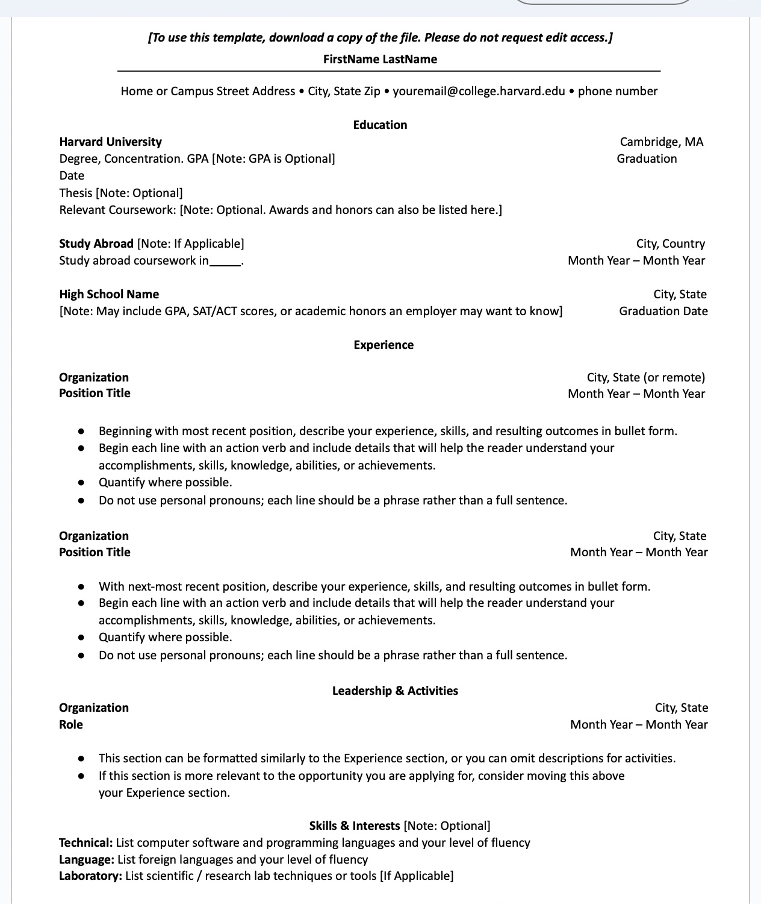
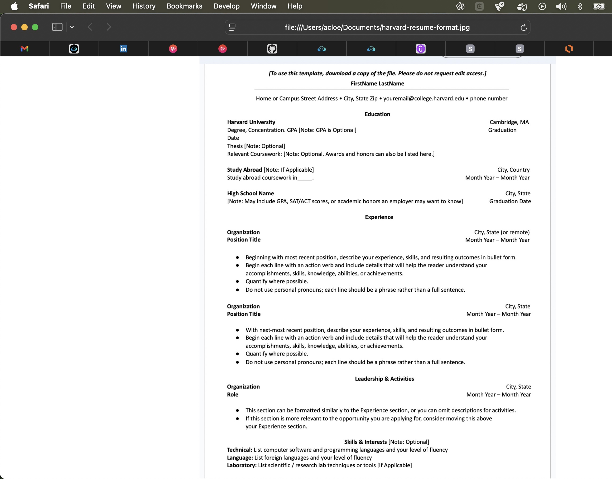

# Frontend Technical Specification

- Create a static website that serves an html resume

## Resume Format Considerations
I'm going to use the [Harvard Resume Template format](https://careerservices.fas.harvard.edu/resources/bullet-point-resume-template/) as the basis of my resume.

### Harvard Resume Format Generation

Not a big expert on HTML and CSS so will use GenAI to do the heavy lifting and I will refractor to my needs.

Prompt to ChatGPT 5.1:

```text
Convert this resume format into hmtl.
Please don't use a CSS framework.
Please use the least amount of css tags
```

Image provided to LLM:


This is the [generated output](./docs/Nov-22-2025-resume-minimal.html) which I will refractor later.

This is what the generated HTML looks like unaltered:


## HTML Adjustments

- Because we will be applying mobile styling to our website, we'll include the viewport meta tag width=device-width so mobile styling scales normally
- We'll extract our styles into its own stylesheet after we are happy with our HTML markup
- We'll simply our HTML markup css selector to be as minimal as possible.
- For the HTML page, I'll use soft tabs two spaces because I like the look.